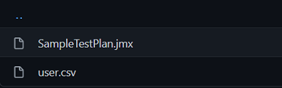

# Project

Automated Performance Pipeline using Apache JMeter and AKS

As the Azure DevOps cloud-based load testing by Microsoft has been deprecated, we evaluated the options and finalized on using Apache JMeter with Azure Kubernetes Service (AKS) in a distributed architecture to carry out an intensive load test by simulating hundreds and thousands of simultaneous users.


Currently we have also implemented an automated pipeline for running the performance test using Apache JMeter and AKS, which is also extended to simulate parallel load from multiple regions to reproduce a production scenario.

<br>
We also have another pipeline to set up the load test infrastructure along with scripts to run test locally. This is recommended when more control and precision is required.

# Contents
- [Prerequisites](#prerequisites-for-onboarding-to-the-automated-pipeline)
- [Test Execution Pipeline](#test-execution-pipeline)
- [Load Test Infrastructure Pipeline](#load-test-infrastructure-pipeline)

## Prerequisites for onboarding to the automated pipeline

Prerequisite script creates Service Connection, App Id, Service Principal and KeyVault. KeyVault has certificate and client secret.
Steps to execute Prerequisite script:

1. Set working directory to Scripts folder where Prerequisite.ps1 resides.
2. Run below command.

```Powershell
   .\Prerequisite -subscriptionId {Azure Subscription Id} -resourceGroupName {Resource Group Name} -keyVaultName {KeyVault Name} -location {Location} -certName {Certificate Name} -servicePrincipalName {Service Principal Name} -tenantId {Microsoft Tenand Id} -serviceConnectionName {Service Connection Name} -organizationName 'https://microsoftit.visualstudio.com' -projectName 'OneITVSO' -ServicePrincipalSecret {Service Principal Sercret Name}
```

3. After execution of Prerequisite script, Search Service Principal Name in Azure Active Directory and fetch App Id.
4. Onboard App Id to resource group with Contributor role.

### JMeter test scripts:

1. create the test suite with the help of how to setup JMeter test plan(https://jmeter.apache.org/usermanual/build-web-test-plan.html).
2. Check in the JMX file and supporting files in a repository

### AKS setup

1. Create AKS cluster with the help of how to create a AKS cluster(https://docs.microsoft.com/en-us/azure/aks/kubernetes-walkthrough-portal)
2. Or it can be created using the [Load Test Infrastrucure Pipeline](#load-test-infrastrucure-pipeline).
3. Provide access to a Service Principal Name which would be used to run the JMX file in the cluster.

## Test Execution Pipeline
### Steps to onboard and execute the pipeline:

1. Fork the test execution YAML pipeline from the repository: JMeterAKSLoadTest(https://github.com/microsoft/JMeterAKSLoadTest.git)
2. Folder structure looks like below
   


3. Inside the JMeterFiles folder add the JMX and supporting files there



4. Overview on the test execution pipeline variables which can be added by users before running the pipeline -

- Tenant – Tenant id
- NameSpace - AKS cluster namespace
- ServiceConnection - Azure service connection
- KeyVaultName - Key vault name for fetching the secrets used in the pipeline
- SecretNames - List of secrets which can be fetched from the key vault e.g. "AKSSPNClientSecret, PerfTestClientSecret"
- AKSResourceGroup - Resource group for keeping AKS resources
- AKSRegion1 - Respective region name e.g. westus2
- AKSRegion2 - Respective region name e.g. cus
- AKSClusterNameRegion1 - Cluster name of the respective region
- AKSClusterNameRegion2 - Cluster name of the respective region
- AKSSPNClientId – Service principal id used for connecting to AKS clusters
- AKSSPNClientSecret – Client secret used for connecting to AKS clusters
- PerfTestResourceId – Resource Id for the API Auth
- PerfTestClientId – Client Id for the API Auth
- CSVFileNames – List of supported file names for execution like “users.csv,ids.csv”


5. Overview on the test execution pipeline parameters which can be configured at every run while running the pipeline -

- IsMultiRegionEnabled - Allows user to optionally choose to run their workloads in more than one region
- IsClusterRequired - Allows users to optionally create and tear down the cluster on demand while running the tests
- JMeterFolderPath – JMX File folder path
- JMeterFileName – JMX File name
- Threads - Number of threads
- Duration - Duration of the test
- Loops - Number of loops
- RampUpTime -Rampup time used to generate load from JMX file


6. The results of the execution is published as artifact and it can be downloaded. The index.html file holds the report of the run.

### Advantages:

1. With minimal cost you can simulate parallel load from different regions to replicate the production scenario.
2. As all the Loops, Threads and Ramp up time variables are configured through pipeline variables you can run the test suite with minimal changes
3. Once the setup is complete no dependency on any specific machine or user credential, therefore it could be run more frequently to understand the application performance.

## Load Test Infrastructure Pipeline

It creates AKS cluster in the desired subscription and resource group. It also creates a default namespace. After creation of the resources required for load test, users can run test multiple times. After completion of testing cycle it is recommended to clean the test resources.

### Steps for running load infrastructure pipeline

For first time setup in your subscription/resource group, ensure to run the pre-requsites script which will setup the Service Principal, Service Connection, Keyvault etc. Check the [Prerequisites](#prerequisites-for-onboarding-to-the-automated-pipeline) section for more details.

Run the pipeline using the following variables -
- DefaultNamespace
- AksClusterName
- ResourceGroup
- ServicePrincipalId
- AksRegion
- NodeVmSize
- ServiceConnection
- KeyVaultName
- SecretNames
- Tenant


### Pre-requisites for running tests on user machine via scripts

- Ensure you have the Azure CLI version 2.9.0 or later
- Ensure you have the aks-preview CLI extension v0.4.55 or higher installed
- Ensure you have installed kubectl v1.18.3+
- Get sufficient permissions on the AKS cluster

### Steps to run test

- Run Following

```Powershell
cd .\Scripts\
.\Run-Test.ps1 -aksClusterName {cluster-name} -resourceGroup {rg-name} -testPath {Full Path to Test File} -agentCount {agent-count}
```

- It creates JMeter master and slave pods on AKS
- Copies Test plan to the master JMeter Pod
- Executes the test plan, after test execution JMeter master and slave pods are deleted


### Collecting Test Results

- At the end of test, path to test results will be displayed in script
- index.html file will give a brief summary of the test execution
- Test report and jmeter server logs can be collected from the report folder

## Contributing

This project welcomes contributions and suggestions. Most contributions require you to agree to a
Contributor License Agreement (CLA) declaring that you have the right to, and actually do, grant us
the rights to use your contribution. For details, visit https://cla.opensource.microsoft.com.

When you submit a pull request, a CLA bot will automatically determine whether you need to provide
a CLA and decorate the PR appropriately (e.g., status check, comment). Simply follow the instructions
provided by the bot. You will only need to do this once across all repos using our CLA.

This project has adopted the [Microsoft Open Source Code of Conduct](https://opensource.microsoft.com/codeofconduct/).
For more information see the [Code of Conduct FAQ](https://opensource.microsoft.com/codeofconduct/faq/) or
contact [opencode@microsoft.com](mailto:opencode@microsoft.com) with any additional questions or comments.

## Trademarks

This project may contain trademarks or logos for projects, products, or services. Authorized use of Microsoft
trademarks or logos is subject to and must follow
[Microsoft's Trademark & Brand Guidelines](https://www.microsoft.com/en-us/legal/intellectualproperty/trademarks/usage/general).
Use of Microsoft trademarks or logos in modified versions of this project must not cause confusion or imply Microsoft sponsorship.
Any use of third-party trademarks or logos are subject to those third-party's policies.
